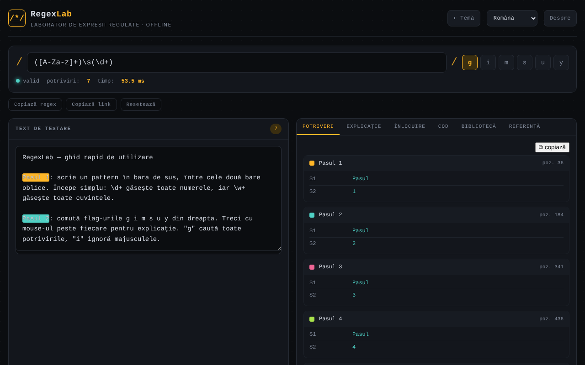

# RegexLab

Laborator de expresii regulate: testare în timp real, explicații, înlocuire, fragmente de cod și bibliotecă de modele, într-un singur fișier HTML.

**Live:** https://chiuta.github.io/RegexLab/

## Ce este

RegexLab este un instrument pentru scrierea și testarea expresiilor regulate JavaScript direct în browser. Textul de test nu părăsește dispozitivul. Interfața are șapte limbi (engleză, română, franceză, italiană, spaniolă, portugheză, germană); limba implicită este engleza.

## Funcții

- Câmp pentru model (`/.../`), fanioane `g i m s u y`, indicator de validitate („valid” / eroare), număr de potriviri și timp de execuție.
- Zona **Test string** cu evidențierea potrivirilor.
- Șase file: **Matches** (potriviri și grupuri), **Explanation** (explicarea modelului), **Replace** (înlocuire cu `$1`, `$2`, `$&`), **Code** (fragmente gata de lipit pentru JavaScript, Python, PHP și Go), **Library** (15 modele gata făcute, în șapte limbi) și **Reference** (fișă de referință).
- Evaluarea rulează într-un Web Worker, cu limită de timp de 1500 ms și mesaj de avertizare la posibil „catastrophic backtracking”.
- Butoane **Copy regex**, **Copy link** (permalink cu modelul, fanioanele, textul și înlocuirea în fragmentul `#` al URL-ului) și **Reset**.
- Temă luminoasă / întunecată (**Theme**), fereastră **About**.

## Manual de utilizare

1. Deschide pagina și alege limba din lista derulantă de limbi din antet.
2. Scrie modelul în câmpul de sus și bifează fanioanele dorite.
3. Lipește sau scrie textul în **Test string**; rezultatele apar imediat în fila **Matches**.
4. Deschide **Explanation** pentru o descompunere a modelului.
5. În **Replace**, scrie șablonul de înlocuire (`$1`, `$2`, `$&`) și citește rezultatul.
6. În **Code**, copiază fragmentul pentru limbajul dorit cu butonul ⧉.
7. În **Library**, apasă un model pentru a-l încărca; în **Reference** găsești sintaxa de bază.
8. **Copy link** creează un link cu starea curentă; **Reset** revine la exemplul implicit; **Esc** închide fereastra About.

## Confidențialitate și rețea

- **Stocare locală (localStorage):** șase chei `regexlab-*`: `regexlab-pattern`, `regexlab-flags`, `regexlab-subject`, `regexlab-replace`, `regexlab-lang`, `regexlab-theme`. Rămân doar în browserul tău.
- **Rețea:** în cod nu există cereri de rețea, scripturi sau fonturi externe. Fereastra About conține linkuri (Patreon, Buy Me a Coffee, site, contact) care se deschid doar la clic. Fără analytics sau telemetrie.
- Linkul creat cu **Copy link** include în URL modelul și textul de test; nu-l partaja dacă textul este sensibil.

## Rulare locală / offline

Descarcă `index.html` și deschide-l în browser; funcționează fără internet.

## Licență

CC0 1.0 Universal (domeniu public) — vezi fișierul LICENSE.

## Audit

Audit: 2026-10-10 — afirmațiile din README (fără cereri de rețea, stocare doar în localStorage) corespund codului; fără `fetch`/CDN/WebSocket. Corecturi de contrast și ARIA.

## Autor

Alexio — Alexandru-Ionuț Chiuță. Contact: alexio@trom.tf

## English summary

RegexLab is a single-file regular-expression laboratory: live matching with highlighting, explanation, replace, code snippets (JavaScript, Python, PHP, Go), a 15-pattern library and a reference sheet, in 7 UI languages. Matching runs in a Web Worker with a 1.5 s timeout. State is kept in localStorage; no network requests or telemetry. CC0 1.0.
